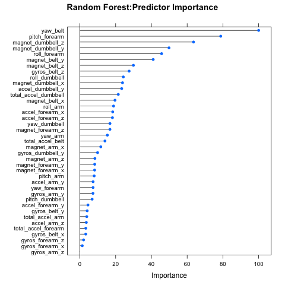

# Predicting Workout Quality with Machine Learning
Cody Henderson  

##Backgroud  
  
Using devices such as Jawbone Up, Nike FuelBand, and Fitbit it is now possible to collect a large amount of data about personal activity relatively inexpensively. These type of devices are part of the quantified self movement – a group of enthusiasts who take measurements about themselves regularly to improve their health, to find patterns in their behavior, or because they are tech geeks. One thing that people regularly do is quantify how much of a particular activity they do, but they rarely quantify how well they do it. In this project, the goal is to use data from accelerometers on the belt, forearm, arm, and dumbell of 6 participants. They were asked to perform barbell lifts correctly and incorrectly in 5 different ways. More information is available from the website [here](http://groupware.les.inf.puc-rio.br/har)  (see the section on the Weight Lifting Exercise Dataset).

****
  
##Data  
  
First, we extract the training and test data and save them into a "data" directory within the working directory.  We will use the training data to build the models.  The test data will be used to make submissions to Coursera for grading purposes.  


```r
if(!exists(file.path(getwd(),"data"))) dir.create(file.path(getwd(),"data"))
```

```
## Warning in dir.create(file.path(getwd(), "data")):
## '/Users/Henderson/Documents/Data Science Coursera/Machine_Learning/data'
## already exists
```

```r
download.file("http://d396qusza40orc.cloudfront.net/predmachlearn/pml-training.csv",
              destfile=file.path(getwd(),"data","training.csv"))
download.file("http://d396qusza40orc.cloudfront.net/predmachlearn/pml-testing.csv",
              destfile=file.path(getwd(),"data","testing.csv"))
```

```r
raw.training.csv <- read.csv(file.path(getwd(),"data","training.csv"),header=T,na.strings=c(NA,'#DIV/0!'))
final.test <- read.csv(file.path(getwd(),"data","testing.csv"),header=T)
```

For the analysis we will need to load the *caret* package.  
  

```r
library(caret)
```

To test our models, we will split the training data into new training (75%) and test (25%) sets.  The downloaded test set will be set aside until grading submission.  The goal is to predict the classe variable, which we will transform into a factor variable.  
  

```r
set.seed(34583)
inTrain = createDataPartition(raw.training.csv$classe, p = 3/4)[[1]]
training = raw.training.csv[ inTrain,]
testing = raw.training.csv[-inTrain,]

training$classe <- factor(training$classe)
testing$classe <- factor(testing$classe)
```
  
****  
  
##Preprocessing Data  
  
Before building models, we can first preprocess the data.  We only care about variables that can actually be predictors for the model.  The first 8 variables in the data appear to be descriptive variables and not predictive variables.  Therefore, we can remove them from the data.  


```r
training <- training[-c(1:8)]
testing <- testing[-c(1:8)]
```
  
**Missing Values**  
Next, we can explore missing variables.  We can see from the table below that variables are either completely missing, almost completely missing, or have no missing values.  Since nearly every row is missing values when ever a variable is missing, we will simply remove these variables from the data.  
  

```r
pct.missing<-as.vector(sapply(training, function(x) sum(is.na(x))/length(x)))
nonmissingcols <- as.vector(sapply(training, function(x) sum(is.na(x))/length(x))<.5)
training <- training[,nonmissingcols]
testing <- testing[,nonmissingcols]
table(round(pct.missing,2))
```

```
## 
##    0 0.98    1 
##   52   94    6
```
  
**Correlated Predictors**  
  
With missing values removed, we will also check for highly correlated variables.  We will remove half of all variables that have a pairwise correlation of at least 0.8.
  

```r
M <- abs(cor(training[,-52]))
high.correlated.vars <- findCorrelation(M,cutoff=.8)
training <- training[,-high.correlated.vars]
testing <- testing[,-high.correlated.vars]
```
  
****  
  
#Model Building  

**Training Models**  
Since the classe variable is a non-binary factor, we will train a cart and a random forest model to make our prediction.


```r
set.seed(33833)
fit.cart <- train(classe~.,data=training, method='rpart')
```

```
## Loading required package: rpart
```

```r
fit.rf <- train(classe~.,data=training, method='rf')
```

```
## Loading required package: randomForest
```

```
## Warning: package 'randomForest' was built under R version 3.1.2
```

```
## randomForest 4.6-10
## Type rfNews() to see new features/changes/bug fixes.
```
  
**Out of Sample Accuracy**    
We can then predict the classe on the testing data generated from the original training data.  

```r
pred.cart <- predict(fit.cart,testing)
pred.rf <- predict(fit.rf,testing)
```
  
The confusion matrix for the CART model produces just 49% accuracy on the test set.  Though the CART model is easy to interpret, 49% is not very good accuracy.

```r
confusionMatrix(pred.cart,testing$classe)
```

```
## Confusion Matrix and Statistics
## 
##           Reference
## Prediction    A    B    C    D    E
##          A 1255  381  405  299  190
##          B   24  301   27   14  121
##          C  116  248  422  281  252
##          D    0   18    1  133   39
##          E    0    1    0   77  299
## 
## Overall Statistics
##                                           
##                Accuracy : 0.4914          
##                  95% CI : (0.4774, 0.5055)
##     No Information Rate : 0.2845          
##     P-Value [Acc > NIR] : < 2.2e-16       
##                                           
##                   Kappa : 0.3366          
##  Mcnemar's Test P-Value : < 2.2e-16       
## 
## Statistics by Class:
## 
##                      Class: A Class: B Class: C Class: D Class: E
## Sensitivity            0.8996  0.31718  0.49357  0.16542  0.33185
## Specificity            0.6366  0.95297  0.77846  0.98585  0.98051
## Pos Pred Value         0.4960  0.61807  0.31994  0.69634  0.79310
## Neg Pred Value         0.9410  0.85329  0.87922  0.85763  0.86702
## Prevalence             0.2845  0.19352  0.17435  0.16395  0.18373
## Detection Rate         0.2559  0.06138  0.08605  0.02712  0.06097
## Detection Prevalence   0.5159  0.09931  0.26896  0.03895  0.07688
## Balanced Accuracy      0.7681  0.63507  0.63602  0.57564  0.65618
```

The random forest model on the other hand predicts the test set with 99.04% accuracy.  Therefore, we expect the out of sample error to be less than 1%.  Clearly, the random forest model provides a huge advantage over the CART model.

```r
confusionMatrix(pred.rf,testing$classe)
```

```
## Confusion Matrix and Statistics
## 
##           Reference
## Prediction    A    B    C    D    E
##          A 1391    8    0    0    0
##          B    3  938    5    0    0
##          C    1    3  845   15    2
##          D    0    0    4  787    3
##          E    0    0    1    2  896
## 
## Overall Statistics
##                                           
##                Accuracy : 0.9904          
##                  95% CI : (0.9873, 0.9929)
##     No Information Rate : 0.2845          
##     P-Value [Acc > NIR] : < 2.2e-16       
##                                           
##                   Kappa : 0.9879          
##  Mcnemar's Test P-Value : NA              
## 
## Statistics by Class:
## 
##                      Class: A Class: B Class: C Class: D Class: E
## Sensitivity            0.9971   0.9884   0.9883   0.9789   0.9945
## Specificity            0.9977   0.9980   0.9948   0.9983   0.9993
## Pos Pred Value         0.9943   0.9915   0.9758   0.9912   0.9967
## Neg Pred Value         0.9989   0.9972   0.9975   0.9959   0.9988
## Prevalence             0.2845   0.1935   0.1743   0.1639   0.1837
## Detection Rate         0.2836   0.1913   0.1723   0.1605   0.1827
## Detection Prevalence   0.2853   0.1929   0.1766   0.1619   0.1833
## Balanced Accuracy      0.9974   0.9932   0.9916   0.9886   0.9969
```

**Predictor Importance**  
From the following plot, we can see the important variables in the random forest model.  We can see from the plot that yaw_belt, pitch_forearm, and magnet_dumbell are the most important factors in predicting classe.  
  

```r
png(file.path(getwd(),'importance_plot.png'))
plot(varImp(fit.rf), main="Random Forest:Predictor Importance")
dev.off()
```

```
## pdf 
##   2
```
  
  
****  
  
##Test Data
We can run the final random forest model on the original test data for grading purposes.  The predictions on the test set are saved into individual files in a new "answers" directory.


```r
answers <- predict(fit.rf,final.test)

if(!exists(file.path(getwd(),"answers"))) dir.create(file.path(getwd(),"answers"))
```

```
## Warning in dir.create(file.path(getwd(), "answers")):
## '/Users/Henderson/Documents/Data Science
## Coursera/Machine_Learning/answers' already exists
```

```r
pml_write_files = function(x){
  n = length(x)
  for(i in 1:n){
    filename = file.path("answers",paste0("problem_id_",i,".txt"))
    write.table(x[i],file=filename,quote=FALSE,row.names=FALSE,col.names=FALSE)
  }
}

pml_write_files(answers)
```


